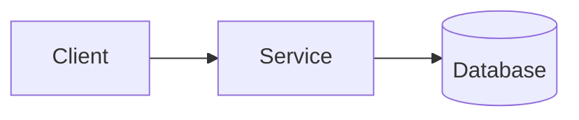

# Design Format Guidelines

Design documents focus on HOW requirements will be implemented. They complement specifications (WHAT/WHY) with architectural decisions, component design, and implementation strategies.

A design MUST reference its corresponding specification and satisfy its requirements without redefining them.

## Required Document Structure
### 1. **Metadata** (Required)
- Title: "Design: [Feature Name]"
- Specification Reference
- Status: Draft | Review | Approved | Superseded

### 2. **Context** (Required)
Establish the technical landscape: current architecture, constraints, dependencies, and non-functional requirements driving design choices. (2-4 paragraphs)

### 3. **Goals and Non-Goals** (Required)
- **Goals**: Specific, measurable outcomes tied to spec requirements
- **Non-Goals**: Explicitly excluded items; reference future work if applicable

### 4. **Options Considered** (Required)
Document at least 2 viable approaches. For each option:
- Description (2-3 sentences)
- Advantages / Disadvantages
- Complexity: Low | Medium | High

Single-option designs require justification for why alternatives weren't viable.

### 5. **Decision** (Required)
- **Chosen Option**: State the selected approach
- **Rationale**: Why this option over alternatives
- **Key Factors**: Deciding factors in priority order

### 6. **Detailed Design** (Required)
Structure based on your domain. Include relevant subsections:

- **Architecture Overview**: Component diagram, data flow, integration points
- **Component Design**: Responsibilities, interfaces, dependencies, state management
- **Data Design**: Schemas, storage approach, caching strategy
- **API Design**: Endpoints, request/response formats, error handling
- **Algorithm Design**: Pseudocode, complexity analysis, edge cases

### 8. **Cross-Cutting Concerns** (Required)
Address as applicable:
- **Security**: Authentication, authorization, data protection
- **Performance**: Bottlenecks, optimization strategies, benchmark targets
- **Reliability**: Failure modes, recovery strategies, rollback procedures
- **Testing**: Unit/integration approach, test data requirements

### 9. **Implementation Plan** (Required)
- Phased approach and milestones
- Migration strategy (if changing existing systems)
- Feature flags if applicable

### 10. **Open Questions** (If applicable)
Unresolved items with owners and blocking/non-blocking status.

## Diagrams

Include diagrams for architecture, data flow, and complex interactions. Use text-based formats (Mermaid, PlantUML, ASCII) for version control.

## Writing Style

- **Justify decisions**: Every choice needs a "because"
- **Be quantifiable**: Use numbers for performance and capacity
- **Use active voice and present tense**
- **Focus on HOW**: Don't redefine spec content
- **Capture uncertainty**: Use Open Questions, not vague statements

